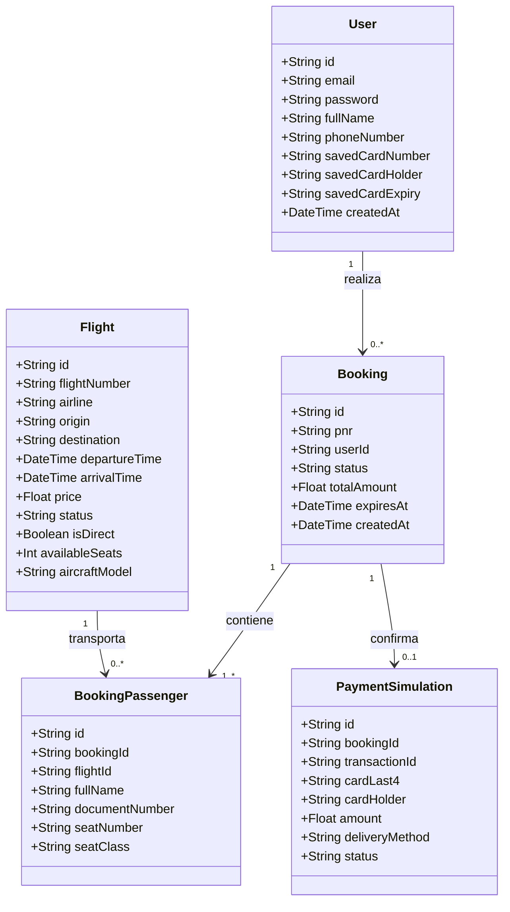
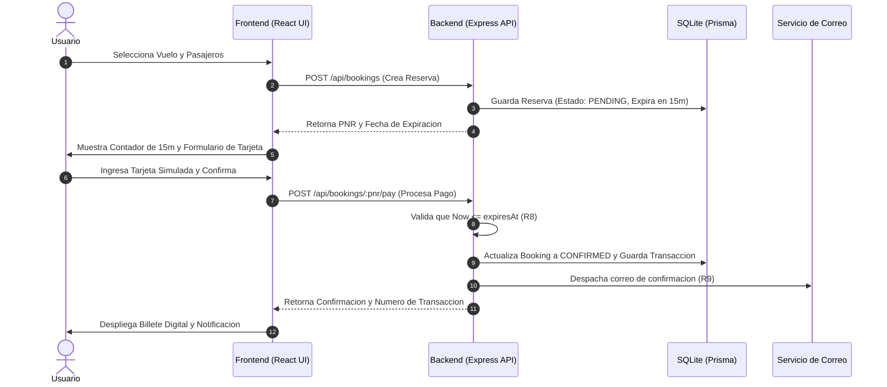

# Sistema de Reserva y Compra de Vuelos - Prueba Tecnica IntouchCX

Aplicacion web Full-Stack para la consulta de vuelos en tiempo real, comparacion de tarifas, gestion de reservas para multiples pasajeros con seleccion de asientos, temporizador de retencion por inactividad de 15 minutos, y simulacion de compra de billetes con despacho de confirmacion por correo.

---

## Tabla de Contenidos

- [Cumplimiento de Requerimientos](#cumplimiento-de-requerimientos)
- [Arquitectura del Proyecto](#arquitectura-del-proyecto)
- [Diagramas del Sistema (UML)](#diagramas-del-sistema-uml)
  - [Diagrama de Clases / Modelo de Datos](#diagrama-de-clases--modelo-de-datos)
  - [Diagrama de Secuencia (Flujo de Reserva y Compra)](#diagrama-de-secuencia-flujo-de-reserva-y-compra)
- [Stack Tecnologico](#stack-tecnologico)
- [Credenciales de Prueba (Demo)](#credenciales-de-prueba-demo)
- [Requisitos y Ejecucion](#requisitos-y-ejecucion)
- [Suite de Pruebas Automatizadas](#suite-de-pruebas-automatizadas)

---

## Cumplimiento de Requerimientos

| Requerimiento | Tipo | Descripcion | Estado |
| :--- | :---: | :--- | :---: |
| **R1: Consulta de Vuelos** | Funcional | Despliegue de vuelos disponibles con datos de aerolinea, horarios y aeronaves en la interfaz. | Implementado |
| **R2: Reserva de Vuelos** | Funcional | Reserva de itinerarios para uno o multiples pasajeros con seleccion de clase y asientos. | Implementado |
| **R3: Compra de Billetes** | Funcional | Simulacion de pasarela de pago con tarjeta de credito y emision del localizador (PNR). | Implementado |
| **R4: Autenticacion y Login** | Funcional | Ingreso con correo y contrasena mediante tokens JWT seguros y menus de usuario dinamicos. | Implementado |
| **R5: Consulta de Tarifas** | Funcional | Filtro y ordenamiento ascendente/descendente de vuelos segun su costo base. | Implementado |
| **R6: Informacion y Estado** | Funcional | Buscador en vivo de estado operativo (EN HORA / DEMORADO), directos vs escalas. | Implementado |
| **R7: Registro de Usuario** | Funcional | Registro con datos personales, almacenamiento de tarjeta opcional y gestion de perfil. | Implementado |
| **R8: Limite de Inactividad (15m)** | Funcional | Temporizador de retencion visual y validacion backend que expira reservas inactivas. | Implementado |
| **R9: Confirmacion al Correo** | Funcional | Despacho simulado de correo con el resumen completo del itinerario y pasajeros. | Implementado |
| **Velocidad y Memoria** | No Funcional | Arquitectura liviana con Node.js, Express, SQLite y Vite para maxima reactividad. | Cumplido |
| **Seguridad** | No Funcional | Cifrado unidireccional de contrasenas con bcrypt (10 rondas de salt). | Cumplido |
| **Usabilidad (<= 2 clics)** | No Funcional | Interfaz responsive adaptada a moviles y escritorios con navegacion agil. | Cumplido |

---

## Arquitectura del Proyecto

El proyecto implementa una **Arquitectura en Capas desacoplada (Layered Clean Architecture)** que asegura una clara separacion de responsabilidades:

```text
IntouchCx-test-Fullstack/
├── backend/                   # API REST en Node.js + Express + TypeScript
│   ├── prisma/                # Esquema relacional SQLite, migraciones y seeders
│   ├── tests/                 # Suite de pruebas automatizadas (Vitest + Supertest)
│   └── src/
│       ├── config/            # Base de datos y variables de entorno
│       ├── controllers/       # Controladores de peticiones HTTP (req, res)
│       ├── middlewares/       # JWT Auth, validacion Zod, control de inactividad
│       ├── models/            # Definiciones de dominio
│       ├── repositories/      # Capa de acceso a datos y consultas Prisma
│       ├── routes/            # Definicion de endpoints REST (/api/v1/...)
│       ├── services/          # Logica central del negocio y casos de uso
│       ├── types/             # DTOs y tipos TypeScript
│       ├── utils/             # Hashing bcrypt, generador PNR, tokens
│       ├── app.ts             # Fabrica de Express y middlewares
│       └── server.ts          # Arranque y escucha del servidor
│
└── frontend/                  # SPA interactiva en React + Vite + TypeScript
    └── src/
        ├── components/        # Navbar responsive, temporizador de inactividad (15m)
        ├── context/           # AuthContext y manejo de sesion global
        ├── pages/
        │   ├── Home.tsx       # Terminal de bienvenida y servicios
        │   ├── Login.tsx      # Inicio de sesion con credenciales demo
        │   ├── Register.tsx   # Registro con soporte de tarjeta guardada
        │   ├── FlightSearch.tsx # Buscador de vuelos, filtros y estado en vivo
        │   ├── BookingCheckout.tsx # Reserva multipasajero, asiento y pago simulado
        │   ├── MyBookings.tsx # Historial de reservas y billetes emitidos
        │   └── Profile.tsx    # Consulta, modificacion y cancelacion de cuenta
        ├── services/          # Cliente API fetch con interceptores
        ├── styles/            # Sistema de diseno moderno (Glassmorphism, Dark Theme)
        └── types/             # Modelos de datos del frontend
```

---

## Diagramas del Sistema (UML)

### Diagrama de Clases / Modelo de Datos



### Diagrama de Secuencia (Flujo de Reserva y Compra)



---

## Stack Tecnologico

- **Backend:** Node.js, Express.js, TypeScript, Prisma ORM, SQLite, bcryptjs, jsonwebtoken, zod, cors.
- **Frontend:** React 18, TypeScript, Vite, React Router DOM, Lucide Icons, Vanilla CSS Design System.
- **Testing:** Vitest, Supertest.
- **Control de Versiones:** Git con estandar **Conventional Commits**.

---

## Credenciales de Prueba (Demo)

El sistema cuenta con un usuario precargado en el seeder para pruebas rapidas:

- **Correo Electronico:** `demo@intouchcx.com`
- **Contrasena:** `Password123!`

---

## Requisitos y Ejecucion

### Requisitos:
- Node.js version 18.x o superior.
- npm version 9.x o superior.

### 1. Instalacion de Dependencias:
```bash
npm run install:all
```

### 2. Inicializar y Poblar Base de Datos:
```bash
npm run prisma:generate
npm run prisma:migrate
npm run prisma:seed
```
*(El seeder carga mas de 5.100 vuelos nacionales en Colombia con rutas de ida y retorno entre Bogota, Medellin, Cali, Cartagena, Barranquilla, Santa Marta, San Andres, etc.).*

### 3. Iniciar Aplicacion en Desarrollo:
```bash
npm run dev
```

- **Frontend:** `http://localhost:5173`
- **Backend API:** `http://localhost:4000`
- **Health Check:** `http://localhost:4000/api/health`

---

## Suite de Pruebas Automatizadas

Para ejecutar la suite completa de 28 pruebas unitarias y de integracion:

```bash
cd backend
npm test
```

### Cobertura de Pruebas:
- `health.test.ts`: Endpoint de salud y captura de rutas 404.
- `auth.test.ts`: Registro, login, hashing bcrypt, JWT 15m, perfil y cancelacion.
- `flight.test.ts`: Busqueda por codigo, nombre de ciudad, parentesis, filtros directos, ordenamiento de tarifas (R5) y estado operativo (R6).
- `booking.test.ts`: Reserva multipasajero (R2), localizador PNR, temporizador de 15m (R8), rechazo de reservas expiradas, compra simulada (R3) y envio de correo (R9).
